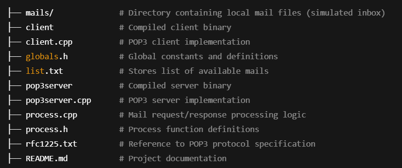

This project is a local implementation of the POP3 (Post Office Protocol v3) using C++ and socket programming. It demonstrates how a mail client interacts with a POP3 server to retrieve, list, and delete emails stored locally.

📂 Project Structure

⚙️ Features

Implements core POP3 commands:

USER, PASS – Authentication

STAT – Mailbox status

LIST – List messages

RETR – Retrieve a message

DELE – Delete a message

QUIT – End session

Local storage of mails inside mails/ folder.

Protocol logic aligned with RFC 1225 POP3 specification.

Built using C++ socket programming.

🚀 Compilation & Usage
1. Compile the project
g++ pop3server.cpp process.cpp -o pop3server
g++ client.cpp -o client

2. Run the server
./pop3server

3. Run the client (in a new terminal)
./client

You can now enter POP3 commands interactively.

📊 Example Session
Client: USER alice
Server: +OK User accepted

Client: PASS 1234
Server: +OK Authenticated

Client: STAT
Server: +OK 3 900

Client: RETR 1
Server: +OK
[Message contents displayed]

Client: QUIT
Server: +OK Goodbye
